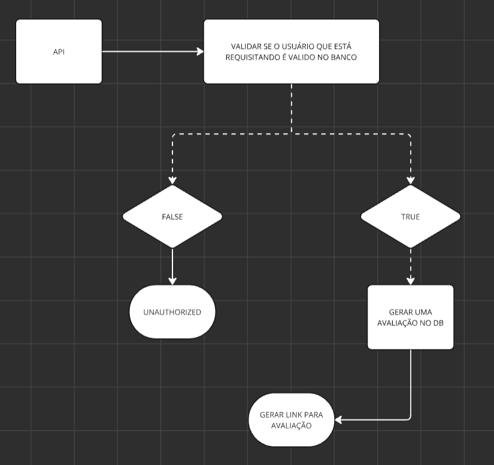

Sistema de avaliação

Esse sistema de avaliação está sendo feito sob uma demanda interna da empresa e estará de livre uso sob a LICENÇA MIT, basta clonar o repositório e fazer a configuração do lado do seu servidor.

Fluxograma base:

Para o auth, deve ser passado o id único(id_avaliacao) no Headers Auth Bearer que é gerado na criação de um usuário pelo back que estará criptografado, estará salvo na tabela de usuários.

Se localizar o usuário vou gerar um JWT encodando as seguintes informações:

`id_atendente -> Pego na tabela`

`nome_atendente -> Pego na tabela`

`id_avaliacao -> Pego na tabela`

`empresa -> Será passado no Body`

`protocolo_atendimento -> Será passado no Body`

Esse JWT expirará em 24 horas, e ele será a informação principal para gerar a URL de avaliação pois será via ROUTE PARAMS, exemplo:

`https://avalia-me/{JWT}`

Todos os JWT’s serão armazenados em uma outra tabela que fará FK com as tabela de avaliações, assim que ele for expirado, automaticamente será deletada do banco de dados (rodará a cada 1 hora já que o token é valido por 1 dia).

Sobre o INSERT da nota imagino que já pegou como vai funcionar, vou mandar o JWT e como meu servidor tem a chave para descriptografar consigo pegar os dados encodados e dar o update com as informações na tabela de avaliações.

Estrutuda do banco:

CREATE DATABASE sistema_avaliacao;

USE sistema_avaliacao;

CREATE TABLE avaliacoes (
    id INT AUTO_INCREMENT PRIMARY KEY,
    uuid VARCHAR(255) NOT NULL,
    nome_atendente VARCHAR(255) NOT NULL,
    empresa_contrato INT NOT NULL,
    nome_empresa VARCHAR(255) NOT NULL,
    nota_atendimento INT NOT NULL,
    nota_empresa INT NOT NULL,
    obs VARCHAR(1000) NOT NULL,
    ip_generated VARCHAR(255) NOT NULL,
    ip_client VARCHAR(255) NOT NULL,
    jwt TEXT NOT NULL,
    status ENUM('pendente', 'avaliado') DEFAULT 'pendente',
    protocolo_atendimento VARCHAR(255) NOT NULL,
    data_ultima_alteracao DATETIME DEFAULT CURRENT_TIMESTAMP ON UPDATE CURRENT_TIMESTAMP,
    data_criacao DATETIME NOT NULL DEFAULT CURRENT_TIMESTAMP
);

@ Dev Full Stack ASTERISK | NEXTJS | NODEJS | MYSQL ~  Rafael Rizzo Breschi

Faça uma doação <3

PIX Chave aleatória: `f96b5084-db1d-4051-85c1-70a7e235c2c6`